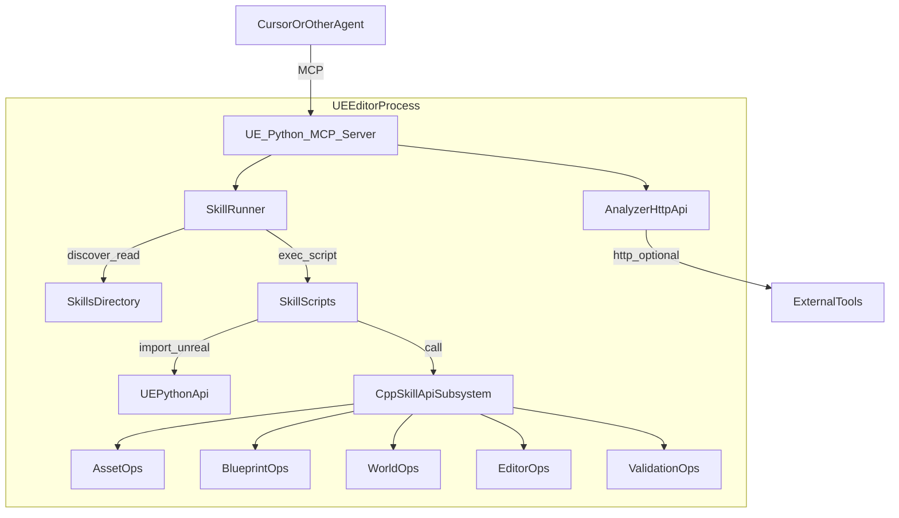
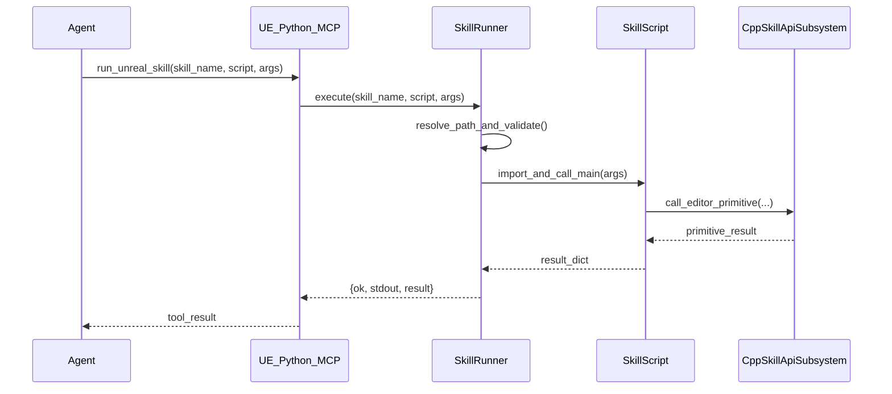

---
name: UE Skill System Spec
overview: 生成一份面向长期维护的 UE Skill System 全面规格文档：明确为何必须引入引擎内 C++ 接口层（CppSkillApiSubsystem），定义 Skill 包结构（SKILL.md+scripts/docs）、三 MCP 工具（list/read/run）契约、Python SkillRunner 行为、以及各子系统（UE C++/UE Python/MCP/Analyzer HTTP）之间的连接关系与落地里程碑。
todos:
  - id: phase-a-skills-dir
    content: 建立 skills/<skill_name>/SKILL.md + scripts/docs 目录规范，并提供至少两个示例 skill（纯文档 + 脚本）
    status: pending
  - id: phase-a-runner
    content: 实现 SkillRunner（discover/list/read/run/inline exec + stdout 捕获 + 路径穿越防护）
    status: pending
  - id: phase-a-tools
    content: 在 UE Python MCP 注册 3 tools：list_unreal_skill/read_unreal_skill/run_unreal_skill，并接入 SkillRunner
    status: pending
    dependencies:
      - phase-a-skills-dir
      - phase-a-runner
  - id: phase-b-cpp-subsystem
    content: 实现 CppSkillApiSubsystem（Asset/Blueprint/World/Editor/Validation 最小原语）并补文档 skills（cpp_*_api）
    status: pending
    dependencies:
      - phase-a-tools
---

# UE Skill System（UnrealCopilot）全面规格文档（Spec）

## 0. 文档定位

本 Spec 用于指导 UnrealCopilot 从“分析型 MCP”演进到“分析 + 可执行技能（Skill）”体系。

- **读者**：插件维护者、未来贡献者、使用 MCP 的 Agent（Cursor/其它）
- **目标**：让任何后来者仅凭本文档就能理解：
  - Skill 是什么、放哪、怎么写
  - Agent 如何发现/阅读/执行
  - UE 内 Python 与 UE 内 C++ 如何协作
  - 哪些能力必须下沉到 C++（并且为什么这是必要的）

## 1. 背景与决策：为什么坚持“UE 内单 Python 进程”

你已验证：UE 进程内 Python 可以同时承担 MCP 暴露、`import unreal`、第三方库、源码解析。

**决策**：继续以 UE 内 Python 作为唯一 MCP 进程，不回退到外部 runner 作为主路径。

**理由（引擎集成视角）**：

- **主线程/对象生命周期约束**：大量 UE 编辑器 API 必须在特定线程与特定时机调用；进程内最易满足。
- **一致性**：外部 Agent 只连接一个 MCP；减少跨进程状态分裂。
- **调试效率**：错误栈、UE Log、对象路径与世界上下文都在同一进程内，定位更直接。

> 外部 runner 仍可作为 CI/headless 的未来补充，但不是主路径。

## 2. 核心观点：为什么必须有“引擎内 C++ 接口暴露层（CppSkillApiSubsystem）”

本系统不是只做“跑 Python 脚本”。为了可持续的工程化能力，**必须提供一层 UE C++ 原语接口**，并把它作为 Skill 可组合的稳定积木。

### 2.1 必要性（不是可选项）

1) **稳定性与覆盖面**

- UE Python 能做很多事，但在“蓝图图表编辑、批量资产改写、事务/Undo、编译/保存链路、性能敏感批处理”等方面，Python 往往要么能力缺口，要么调用链不稳定（版本/时序/线程）。
- C++ 子系统可以直接调用 Editor/Asset/Blueprint 相关模块的底层 API，覆盖面更完整。

2) **线程与安全边界**

- C++ 子系统可以集中实现“强制主线程执行”“对象有效性检查”“世界上下文校验”，避免脚本各写各的防护。

3) **工程一致性（避免技能脚本变成一堆“手写小引擎”）

- 没有 C++ 原语层，脚本会不可避免地复制：加载/保存/编译/重定向修复/路径规范化/错误格式化。
- 原语层统一这些“必然重复”的细节，Skill 脚本才能真正保持轻量与可维护。

4) **长期演进空间**

- 未来即便要加入更强能力（例如节点级蓝图编辑、批量重构、引用重写），C++ 子系统是唯一合理承载点。

### 2.2 仍保持“私人调试项目”的自由度

- 我们不做重型权限系统；但 C++ 原语层依然必要。
- 自由度体现在：`run_unreal_skill` 允许 inline Python；技能脚本可按需组合原语。

## 3. 总体架构（子系统关系必须清晰）

### 3.1 组件划分

- **UE 内 Python MCP Server**：对外暴露 MCP tools；负责技能发现/阅读/执行。
- **SkillRunner（Python）**：扫描 `skills/`、解析 `SKILL.md` 题头、执行脚本/inline Python、捕获 stdout、统一返回。
- **CppSkillApiSubsystem（C++）**：提供通用编辑原语（Asset/Blueprint/World/Editor/Validation）。
- **Analyzer HTTP API（现有）**：保留用于“分析/只读/跨进程访问”与大结果分片；不承担 Skill 写操作主路径。

### 3.2 架构图（数据流）



### 3.3 时序图（典型：Agent 运行一个 skill 脚本）



## 4. Skill 的定义与目录规范（标准实践）

### 4.1 目录位置

- `Plugins/UnrealCopilot/skills/<skill_name>/`

### 4.2 Skill 的组成

- `SKILL.md`：文档 + 关键约束（人类可写，AI 可读）
- `scripts/*.py`：可执行脚本（在 UE Python 环境下可运行）
- `docs/*.md`（可选）：拆分子说明文件（被 `SKILL.md` 引用，用于按需阅读）

目录示例：

```text
Plugins/UnrealCopilot/skills/
  blueprint_read/
    SKILL.md
    docs/
      overview.md
      examples.md
    scripts/
      dump_blueprint_summary.py

  blueprint_write/
    SKILL.md
    docs/
      safety.md
      operations.md
    scripts/
      set_cdo_property.py
      add_component.py

  cpp_blueprint_api/
    SKILL.md
    docs/
      api_reference.md
    scripts/
```

### 4.3 SKILL.md 的 YAML 题头（仅用于 list 摘要）

- 题头可选，格式：
```yaml
---
name: blueprint_write
description: Blueprint 写入能力合集（CDO/组件树/编译/保存），含脚本。
tags: [blueprint, write]
---
```

- 仅使用 `name/description/tags`（最小字段）；其余内容写正文或 docs。

## 5. MCP Tools 设计（3 个；同步；最少默认行为）

### 5.1 list_unreal_skill

- **输入**：`query`（可选）
- **输出**：`skills: [{name, description, tags, skill_root}]`
- **规则**：
  - 只返回摘要（题头 + 必要的 fallback）
  - 不返回全文、不返回 tree

### 5.2 read_unreal_skill

- **输入**：
  - `skill_name`
  - `path`（可选；空则默认读取 `SKILL.md`）
- **输出**：
  - `content`: 文件内容
  - `tree`: **仅当 `path` 为空**时返回（第一次理解目录；后续由上下文管理避免重复）
- **安全规则**：
  - `path` 必须限制在该 skill 根目录内（防路径穿越）

### 5.3 run_unreal_skill

- **模式 A：运行脚本**
  - 输入：`skill_name`, `script`, `args`（可选）
- **模式 B：inline Python**
  - 输入：`python`, `args`（可选）
  - 执行环境提供 `ARGS`（dict）
- **输出**：`ok`, `stdout`, `result`, `error`
- **执行模型**：全部同步，不引入 job。

## 6. Script 执行约定（最少但稳定）

### 6.1 推荐入口

- 推荐脚本提供：`def main(args: dict) -> dict`
- Runner 行为：
  - import 模块
  - 若存在 `main`：调用并拿到 dict 结果
  - 捕获 `print` 输出为 `stdout`
  - 异常返回 traceback

### 6.2 允许自由度

- 对于“不适合 main”的脚本（纯演示/一次性），可以直接执行文件，但必须在 SKILL.md 明确说明输入输出约定。

## 7. CppSkillApiSubsystem：必须实现的通用原语范围（不为项目定制）

### 7.1 原语分组（建议按域拆成文档 skill）

- `skills/cpp_asset_api/`：资产原语说明
- `skills/cpp_blueprint_api/`：蓝图原语说明
- `skills/cpp_world_api/`：世界/关卡原语说明
- `skills/cpp_editor_api/`：保存/事务/撤销等
- `skills/cpp_validation_api/`：验证/编译摘要

### 7.2 最小必备原语（第一阶段就应具备）

- **AssetOps**
  - create/duplicate/rename/move/delete
  - save（按包/按资产）
  - fix_redirectors（可选但强烈建议，因为改名/移动之后必然会遇到）
- **BlueprintOps**
  - create blueprint（指定父类）
  - set CDO property（默认值写入）
  - 组件树操作（add/remove/attach/set default props）
  - compile blueprint、save blueprint
- **WorldOps（Editor）**
  - load map
  - spawn/find/destroy actor
  - set actor/component properties + transform
- **EditorOps**
  - list dirty packages
  - save dirty / save all
  - transaction/undo（能做就做；做不了必须返回明确错误与文档说明）
- **ValidationOps**
  - compile all blueprints summary（errors/warnings）
  - basic asset validation summary（引用缺失/非法路径等，尽量聚合）

> 这些原语的返回应当结构化（dict），但不要求强 schema；说明写入相应 skill 文档。

## 8. 与现有 UnrealCopilot 的连接点（基于当前代码结构）

- UE 内 Python MCP 生命周期（已存在）：
  - `Plugins/UnrealCopilot/Content/Python/init_analyzer.py`
  - `Plugins/UnrealCopilot/Source/UnrealCopilot/Private/AnalyzerSubsystem.cpp`
- MCP tools 注册入口（已存在）：
  - `Plugins/UnrealCopilot/Content/Python/analyzer/server.py`
- HTTP Analyzer 路由（已存在，保留定位为分析/跨进程）：
  - `Plugins/UnrealCopilot/Source/UnrealCopilot/Private/UnrealAnalyzerHttpRoutes.cpp`

## 9. 落地路线（重大改动必须分阶段，但不降低关键组件）

### Phase A：Skill 体系闭环（目录 + 3 tools + runner）

- 建立 `skills/` 目录规范
- 实现 SkillRunner（discover/read/run/inline exec + stdout 捕获 + 路径穿越防护）
- 在 MCP 注册 3 tools：list/read/run

### Phase B：CppSkillApiSubsystem（通用原语层）

- 新增 C++ 子系统并实现最小原语（Asset/Blueprint/World/Editor/Validation）
- 用 skill 文档体系拆分说明（cpp_*_api skills），让 Agent 按需阅读
- 提供 2-3 个 scripts 示例：演示如何组合 C++ 原语完成实际编辑任务

### Phase C：能力扩展（保持原则：文档即接口，脚本即能力）

- 逐步补齐更复杂的蓝图编辑能力（例如节点级操作，如果你决定要做）
- 逐步补齐更强的验证/诊断脚本（仍同步）

## 10. 明确不做（当前阶段）

- 不引入异步 job/进度轮询系统
- 不引入强 schema/大量元数据字段
- 不引入严格权限/allowlist（私人调试项目），但必须做最小安全边界（尤其路径穿越防护）

## 11. Implementation Todos（可追踪）

- **A1**：新增 `Plugins/UnrealCopilot/skills/`，放入至少 2 个示例 skills（一个纯文档，一个脚本）
- **A2**：实现 SkillRunner（Python）并提供：discover/list/read/run/inline exec、stdout 捕获、路径防护
- **A3**：在 `server.py` 注册 3 tools 并接入 runner
- **B1**：新增 `CppSkillApiSubsystem`（C++）并实现最小原语
- **B2**：新增 `cpp_*_api` 文档 skills，拆分写清接口与例子
